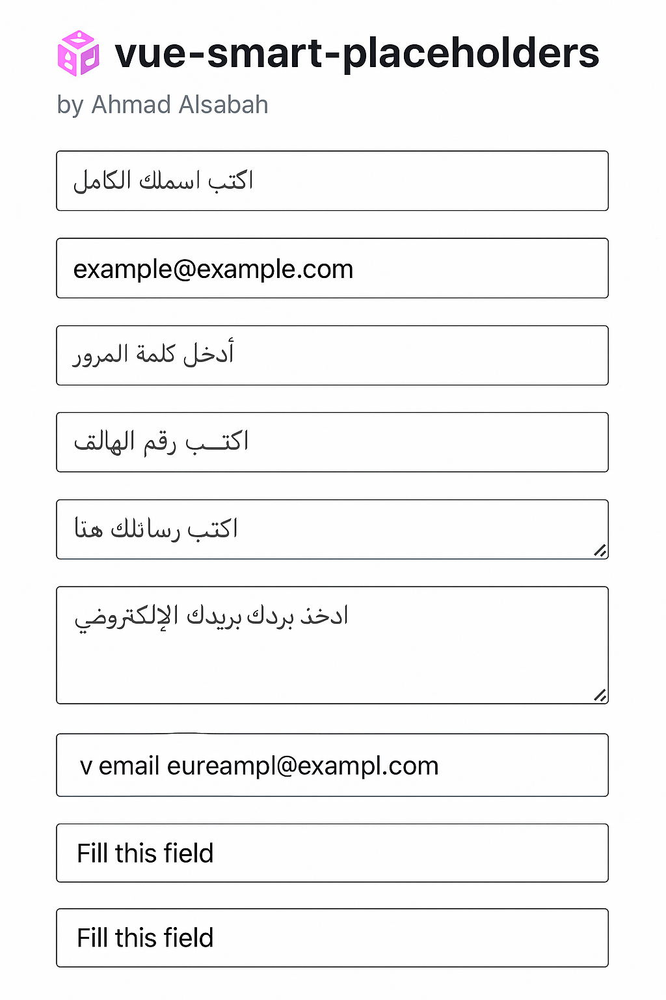

# 📦 vue-smart-placeholders

A Vue.js directive that adds **smart, localized placeholders** to your `<input>` and `<textarea>` elements — automatically based on field type or name.  
Supports both **Vue 2** and **Vue 3** ✅

---

## ✨ Features

- 🧠 Automatically detects input purpose (like email, name, phone)
- 🌍 Supports Arabic and English placeholders based on browser language
- ⚙️ Works with both Vue 2 & Vue 3 out of the box
- 🔌 Tiny, dependency-free

---
## 📸 Demo



## 📦 Installation

### Using NPM

```bash
npm install vue-smart-placeholders

